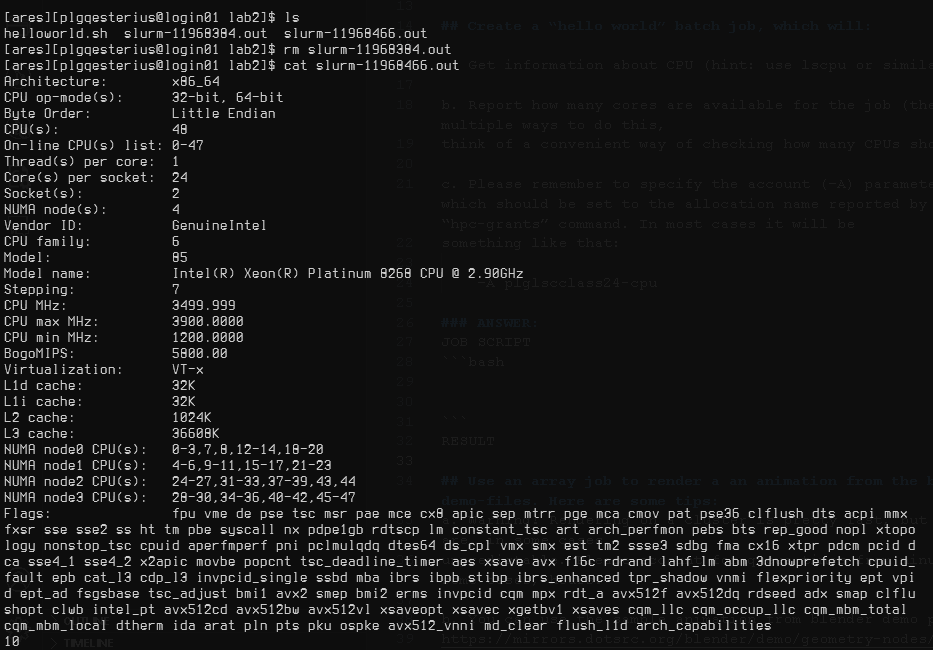
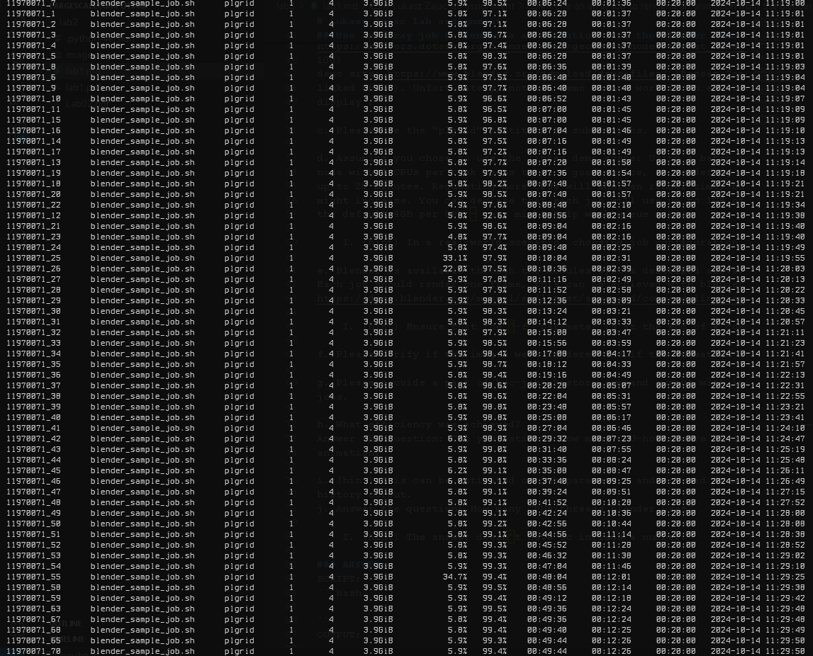

# Lukasz Zajac lab assignment

## Answer the questions:
a. Explain the purpose of the $SCRATCH filesystem accoriding to the documentation. What
filesystem is used for $SCRATCH and can you explain in a simple way why ext4/xfs/nfs
cannot be used here?

b. What is the main feature (and benefit) of an RDMA network transfer? Why is it
important for highly parallel jobs? What network types offer RDMA?
### ANSWER:
a. 
b.

## Create a “hello world” batch job, which will:

a. Get information about CPU (hint: use lscpu or similar command)

b. Report how many cores are available for the job (there are multiple ways to do this,
think of a convenient way of checking how many CPUs should be used)

c. Please remember to specify the account (–A) parameter for jobs, which should be set to the allocation name reported by “hpc-grants” command. In most cases it will be
something like that:

    –A plglscclass24-cpu

### ANSWER:
JOB SCRIPT
```bash
#!/bin/bash
#SBATCH -A plglscclass24-cpu
#SBATCH --cpus-per-task=10
#SBATCH --time=00:01:00


lscpu
nproc
```
RESULT

## Use an array job to render a an animation from the blender demo-files. Here are some tips:
a. Warning! Rendering on a cluster is pretty fast, but queue times are, in some cases,
unpredictable. Please account for queue times from minutes to, in some cases, hours!

b. You can use the sample animation from blender demo page:
https://mirrors.dotsrc.org/blender/demo/geometry-nodes/repeat_zone_flower_by_MiRA.blend (frame range for this animation is from 1 to
100)
demo site: https://www.blender.org/download/demo-files/ (Repeat Zone – Flower is
linked above). Unfortunately, not all demo scenes work in an environment without
display :(

c. Please use the “plgrid” partition to submit jobs.

d. Assuming you chose to use the linked demo scene: Using a batch job configuration of 1
node with 4 CPUs per task seems to be a good choice, as rendering one frame may take
up to 20 minutes. Requesting more CPUs will shorten render time, but queue times
might increase. You can declare that each job will use up to 1GB of memory instead of
the default 4GB per CPU – this might help with queue times.

    I. (hint) In a real-world scenario, choosing job configuration, accounting for application performance, and queue times is one of the main challenges of using a cluster-real world scenario, choosing job configuration, accounting for application performance and queue times is one of the main challenges of using a cluster.

e. Blender is available through the modules system described above.
Each job should render one frame, this can be achieved with blender this way:
https://docs.blender.org/manual/en/latest/advanced/command_line/render.html

    I. (hint) Ensure that the ‘-f’ parameter is at the end of a command line! Blender tends to ignore it otherwise. 

f. Please verify if the images were rendered and if the animation looks OK.

g. Please provide a part of hpc-jobs-history command output with information about your
jobs.

h. What efficiency was achieved?
Answer the question: Can you estimate how many CPU-hours were used for the whole
animation?

i. (hint) This can be estimated on job parameters and/or read from the hpc-jobs-
history ourput.
j. Answer the question: How many CPUs/threads blender uses?

    I. (hint) The answer doesn’t have to include a number.

### ANSWER:
SCRIPT: 
```bash
#!/bin/bash
#SBATCH -N 1
#SBATCH
#SBATCH -A plglscclass24-cpu
#SBATCH --cpus-per-task=4
#SBATCH --time=00:20:00
#SBATCH --array=1-100
#SBATCH --mem-per-cpu=1000M

modules load blender
blender -b repeat_zone_flower_by_MiRA.blend  -f $SLURM_ARRAY_TASK_ID                                                         
```
OUTPUT:
i have typo in module load, but loaded blender earlier so it worked
```
[ares][plgqesterius@login01 lab2]$ cat slurm-11970071_1.out
/var/spool/slurmd/job11970072/slurm_script: line 10: modules: command not found
Blender 4.2.2 LTS (hash c03d7d98a413 built 2024-09-24 00:09:56)
Read blend: "/net/people/plgrid/plgqesterius/labs/lab2/repeat_zone_flower_by_MiRA.blend"
Fra:1 Mem:20.24M (Peak 20.90M) | Time:00:00.00 | Mem:0.00M, Peak:0.00M | Scene, View Layer | Synchronizing object | Rose
Fra:1 Mem:20.49M (Peak 20.90M) | Time:00:00.00 | Mem:0.00M, Peak:0.00M | Scene, View Layer | Initializing
Fra:1 Mem:17.73M (Peak 20.90M) | Time:00:00.01 | Mem:0.00M, Peak:0.00M | Scene, View Layer | Waiting for render to start
Fra:1 Mem:17.73M (Peak 20.90M) | Time:00:00.01 | Mem:0.00M, Peak:0.00M | Scene, View Layer | Loading render kernels (may take a few minutes the first time)
Fra:1 Mem:17.73M (Peak 20.90M) | Time:00:00.01 | Mem:0.00M, Peak:0.00M | Scene, View Layer | Updating Scene
Fra:1 Mem:17.73M (Peak 20.90M) | Time:00:00.01 | Mem:0.00M, Peak:0.00M | Scene, View Layer | Updating Shaders
Fra:1 Mem:17.83M (Peak 20.90M) | Time:00:00.01 | Mem:0.02M, Peak:0.02M | Scene, View Layer | Updating Procedurals
Fra:1 Mem:17.83M (Peak 20.90M) | Time:00:00.01 | Mem:0.02M, Peak:0.02M | Scene, View Layer | Updating Background
Fra:1 Mem:17.83M (Peak 20.90M) | Time:00:00.01 | Mem:0.02M, Peak:0.02M | Scene, View Layer | Updating Camera
Fra:1 Mem:17.83M (Peak 20.90M) | Time:00:00.01 | Mem:0.02M, Peak:0.02M | Scene, View Layer | Updating Meshes Flags
Fra:1 Mem:17.83M (Peak 20.90M) | Time:00:00.01 | Mem:0.02M, Peak:0.02M | Scene, View Layer | Updating Objects
Fra:1 Mem:17.83M (Peak 20.90M) | Time:00:00.01 | Mem:0.02M, Peak:0.02M | Scene, View Layer | Updating Objects | Copying Transformations to device
Fra:1 Mem:17.84M (Peak 20.90M) | Time:00:00.01 | Mem:0.03M, Peak:0.03M | Scene, View Layer | Updating Objects | Applying Static Transformations
Fra:1 Mem:17.84M (Peak 20.90M) | Time:00:00.01 | Mem:0.03M, Peak:0.03M | Scene, View Layer | Updating Particle Systems
Fra:1 Mem:17.84M (Peak 20.90M) | Time:00:00.01 | Mem:0.03M, Peak:0.03M | Scene, View Layer | Updating Particle Systems | Copying Particles to device
Fra:1 Mem:17.84M (Peak 20.90M) | Time:00:00.01 | Mem:0.03M, Peak:0.03M | Scene, View Layer | Updating Meshes
Fra:1 Mem:17.88M (Peak 20.90M) | Time:00:00.01 | Mem:0.03M, Peak:0.03M | Scene, View Layer | Updating Mesh | Computing attributes
Fra:1 Mem:17.97M (Peak 20.90M) | Time:00:00.01 | Mem:0.03M, Peak:0.03M | Scene, View Layer | Updating Mesh | Copying Attributes to device
Fra:1 Mem:17.96M (Peak 20.90M) | Time:00:00.01 | Mem:0.12M, Peak:0.12M | Scene, View Layer | Updating Geometry BVH Mesh 9/9 | Building BVH
Fra:1 Mem:17.96M (Peak 20.90M) | Time:00:00.01 | Mem:0.12M, Peak:0.12M | Scene, View Layer | Updating Geometry BVH Plane 1/9 | Building BVH
Fra:1 Mem:17.96M (Peak 20.90M) | Time:00:00.01 | Mem:0.12M, Peak:0.12M | Scene, View Layer | Updating Geometry BVH Mesh 3/9 | Building BVH
Fra:1 Mem:17.96M (Peak 20.90M) | Time:00:00.01 | Mem:0.12M, Peak:0.12M | Scene, View Layer | Updating Geometry BVH Mesh 4/9 | Building BVH
Fra:1 Mem:17.96M (Peak 20.90M) | Time:00:00.01 | Mem:0.15M, Peak:0.15M | Scene, View Layer | Updating Geometry BVH Mesh 4/9 | Building BVH 0%
Fra:1 Mem:17.96M (Peak 20.90M) | Time:00:00.01 | Mem:0.22M, Peak:0.22M | Scene, View Layer | Updating Geometry BVH Mesh 8/9 | Building BVH
Fra:1 Mem:17.96M (Peak 20.90M) | Time:00:00.01 | Mem:0.19M, Peak:0.22M | Scene, View Layer | Updating Geometry BVH Mesh 6/9 | Building BVH
Fra:1 Mem:17.96M (Peak 20.90M) | Time:00:00.01 | Mem:0.20M, Peak:0.22M | Scene, View Layer | Updating Geometry BVH Mesh 7/9 | Building BVH
Fra:1 Mem:17.96M (Peak 20.90M) | Time:00:00.01 | Mem:0.27M, Peak:0.29M | Scene, View Layer | Updating Scene BVH | Building
Fra:1 Mem:17.96M (Peak 20.90M) | Time:00:00.01 | Mem:0.27M, Peak:0.29M | Scene, View Layer | Updating Scene BVH | Building BVH
Fra:1 Mem:17.96M (Peak 20.90M) | Time:00:00.01 | Mem:0.29M, Peak:0.29M | Scene, View Layer | Updating Scene BVH | Copying BVH to device
Fra:1 Mem:17.96M (Peak 20.90M) | Time:00:00.01 | Mem:0.29M, Peak:0.29M | Scene, View Layer | Updating Mesh | Computing normals
Fra:1 Mem:18.04M (Peak 20.90M) | Time:00:00.01 | Mem:0.29M, Peak:0.29M | Scene, View Layer | Updating Mesh | Copying Mesh to device
Fra:1 Mem:18.04M (Peak 20.90M) | Time:00:00.01 | Mem:0.36M, Peak:0.36M | Scene, View Layer | Updating Objects Flags
Fra:1 Mem:18.04M (Peak 20.90M) | Time:00:00.01 | Mem:0.36M, Peak:0.36M | Scene, View Layer | Updating Primitive Offsets
Fra:1 Mem:18.04M (Peak 20.90M) | Time:00:00.01 | Mem:0.36M, Peak:0.36M | Scene, View Layer | Updating Images
Fra:1 Mem:18.04M (Peak 20.90M) | Time:00:00.01 | Mem:0.36M, Peak:0.36M | Scene, View Layer | Updating Images | Loading sky_nishita
Fra:1 Mem:19.05M (Peak 20.90M) | Time:00:00.11 | Mem:1.36M, Peak:1.36M | Scene, View Layer | Updating Camera Volume
Fra:1 Mem:19.05M (Peak 20.90M) | Time:00:00.11 | Mem:1.36M, Peak:1.36M | Scene, View Layer | Updating Lookup Tables
Fra:1 Mem:19.05M (Peak 20.90M) | Time:00:00.11 | Mem:1.44M, Peak:1.44M | Scene, View Layer | Updating Lights
Fra:1 Mem:19.05M (Peak 20.90M) | Time:00:00.11 | Mem:1.44M, Peak:1.44M | Scene, View Layer | Updating Lights | Importance map
Fra:1 Mem:20.06M (Peak 24.55M) | Time:00:00.12 | Mem:2.46M, Peak:4.96M | Scene, View Layer | Updating Lights | Computing tree
Fra:1 Mem:20.06M (Peak 24.55M) | Time:00:00.12 | Mem:2.46M, Peak:4.96M | Scene, View Layer | Updating Integrator
Fra:1 Mem:21.06M (Peak 24.55M) | Time:00:00.12 | Mem:3.46M, Peak:4.96M | Scene, View Layer | Updating Film
Fra:1 Mem:21.06M (Peak 24.55M) | Time:00:00.12 | Mem:3.38M, Peak:4.96M | Scene, View Layer | Updating Lookup Tables
Fra:1 Mem:21.06M (Peak 24.55M) | Time:00:00.12 | Mem:3.46M, Peak:4.96M | Scene, View Layer | Updating Baking
Fra:1 Mem:21.06M (Peak 24.55M) | Time:00:00.12 | Mem:3.46M, Peak:4.96M | Scene, View Layer | Updating Device | Writing constant memory
Fra:1 Mem:21.06M (Peak 24.55M) | Time:00:00.12 | Mem:3.46M, Peak:4.96M | Scene, View Layer | Sample 0/256
Fra:1 Mem:100.18M (Peak 100.18M) | Time:00:00.58 | Remaining:01:58.16 | Mem:82.57M, Peak:82.57M | Scene, View Layer | Sample 1/256
Fra:1 Mem:100.18M (Peak 100.18M) | Time:00:28.73 | Remaining:01:24.08 | Mem:82.57M, Peak:82.57M | Scene, View Layer | Sample 65/256
Fra:1 Mem:100.18M (Peak 100.18M) | Time:00:35.42 | Remaining:01:17.66 | Mem:82.57M, Peak:82.57M | Scene, View Layer | Sample 80/256
Fra:1 Mem:100.18M (Peak 100.18M) | Time:00:40.74 | Remaining:01:07.69 | Mem:82.57M, Peak:82.57M | Scene, View Layer | Sample 96/256
Fra:1 Mem:100.18M (Peak 100.18M) | Time:00:46.06 | Remaining:00:59.06 | Mem:82.57M, Peak:82.57M | Scene, View Layer | Sample 112/256
Fra:1 Mem:100.18M (Peak 100.18M) | Time:00:51.30 | Remaining:00:51.18 | Mem:82.57M, Peak:82.57M | Scene, View Layer | Sample 128/256
Fra:1 Mem:100.18M (Peak 100.18M) | Time:00:56.52 | Remaining:00:43.86 | Mem:82.57M, Peak:82.57M | Scene, View Layer | Sample 144/256
Fra:1 Mem:100.18M (Peak 100.18M) | Time:01:01.78 | Remaining:00:36.99 | Mem:82.57M, Peak:82.57M | Scene, View Layer | Sample 160/256
Fra:1 Mem:100.18M (Peak 100.18M) | Time:01:07.20 | Remaining:00:30.49 | Mem:82.57M, Peak:82.57M | Scene, View Layer | Sample 176/256
Fra:1 Mem:100.18M (Peak 100.18M) | Time:01:12.44 | Remaining:00:24.10 | Mem:82.57M, Peak:82.57M | Scene, View Layer | Sample 192/256
Fra:1 Mem:100.18M (Peak 100.18M) | Time:01:17.69 | Remaining:00:17.90 | Mem:82.57M, Peak:82.57M | Scene, View Layer | Sample 208/256
Fra:1 Mem:100.18M (Peak 100.18M) | Time:01:22.93 | Remaining:00:11.83 | Mem:82.57M, Peak:82.57M | Scene, View Layer | Sample 224/256
Fra:1 Mem:100.18M (Peak 100.18M) | Time:01:28.18 | Remaining:00:05.87 | Mem:82.57M, Peak:82.57M | Scene, View Layer | Sample 240/256
Fra:1 Mem:139.73M (Peak 210.93M) | Time:01:33.46 | Mem:82.57M, Peak:82.57M | Scene, View Layer | Sample 256/256
Fra:1 Mem:139.73M (Peak 210.93M) | Time:01:33.46 | Mem:82.57M, Peak:82.57M | Scene, View Layer | Finished
Fra:1 Mem:57.08M (Peak 210.93M) | Time:01:33.47 | Compositing
Fra:1 Mem:57.08M (Peak 210.93M) | Time:01:33.47 | Compositing | Initializing execution
Fra:1 Mem:57.09M (Peak 210.93M) | Time:01:33.48 | Compositing | Operation 2-6
Fra:1 Mem:57.09M (Peak 210.93M) | Time:01:33.48 | Compositing | Operation 3-6
Fra:1 Mem:88.79M (Peak 210.93M) | Time:01:33.48 | Compositing | Operation 4-6
Fra:1 Mem:88.79M (Peak 210.93M) | Time:01:33.48 | Compositing | Operation 5-6
Fra:1 Mem:88.79M (Peak 210.93M) | Time:01:34.57 | Compositing | Operation 6-6
Fra:1 Mem:88.79M (Peak 210.93M) | Time:01:34.58 | Compositing | Operation 7-6
Saved: '/net/people/plgrid/plgqesterius/labs/lab2/flower_render_test/Flower01_0001.png'
Time: 01:34.87 (Saving: 00:00.28)
```

CONVERSION TO GIF:
```powershell
ffmpeg -framerate 10 -i Flower01_%04d.png -vf "scale=800:-1:flags=lanczos,palettegen" -y palette.png
ffmpeg -framerate 10 -i Flower01_%04d.png -i palette.png -lavfi "scale=800:-1:flags=lanczos [x]; [x][1:v] paletteuse" -y output.gif
```


HPC-JOBS-HISTORY:
not everything, because list contains 100rows, but idea is apparent
