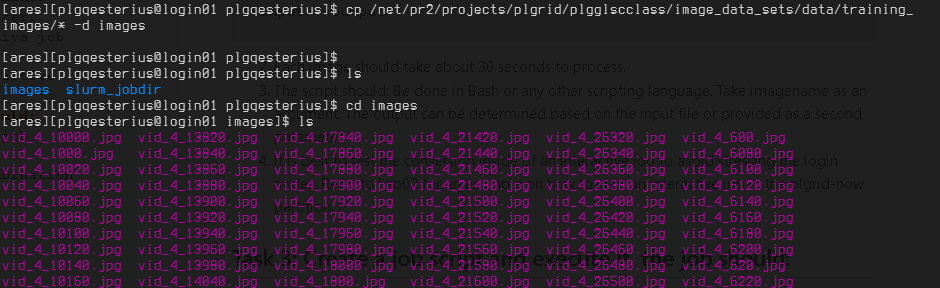

# Lukasz Zajac lab 3 assignment
## Task 1: Obtain the image set which will serve as input for processing
1. A set of 1000 images are available at the following path:
/net/pr2/projects/plgrid/plgglscclass/image_data_sets/data/training_images/
2. Copy the images to a new directory in `$SCRATCH`.


## Task 2: Create `converter.sh` script for image conversion using ImageMagick
1. The conversion command using ImageMagick is:
```bash
magick convert -adaptive-resize 3840x2160 -adaptive-sharpen 10 <input> <output>
```
2. Each image should take about 30 seconds to process.
3. The script should:
    Be done in Bash or any other scripting language.
    Take imagename as an argument. The output can be determined based on the input file or provided as a second parameter.
4. It is best to test the conversion inside of an interactive job to avoid stressing the login nodes.
    Refer to Lab02 for an example on how to start an interactive job in the plgrid-now partition.
## Task 3: Create a job script and execute it, the job should:
1. Process in parallel multiple images inside of a single job
2. Use the converter script from previous point
3. Parallelization should be done using xargs ... srun combination
4. Determine the proper –P parameter for xargs
5. Determine the proper srun arguments
6. Each process should be a single task using 1 core
7. How to create a convenient input for xargs?
8. Please add the:
    ```bash 
    export OMP_NUM_THREADS=1
    ```
right after the #SBATCH directives, this will instruct imagemagic to use single core per
process.

9. The job template is included below

```bash
#!/bin/bash -l
#SBATCH --nodes=1
#SBATCH --ntasks-per-node=48
#SBATCH --cpus-per-task=1
#SBATCH --account=plgglscclass24
#SBATCH --partition=plgrid-now
#SBATCH --time=01:00:00
# above config is mandatory!

export OMP_NUM_THREADS=1
# modules initialization
...
# data handling and work
...
# end of the script'
```